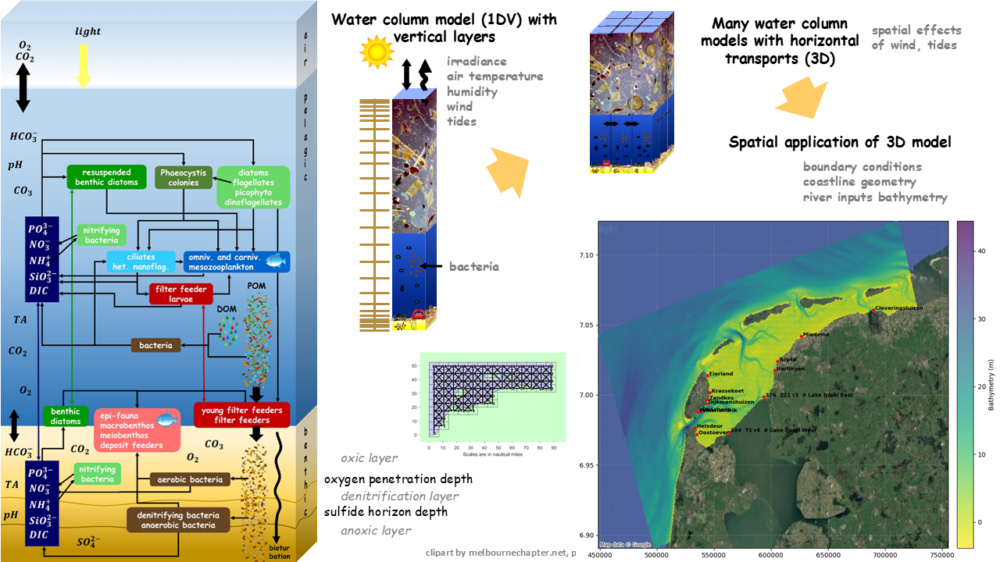
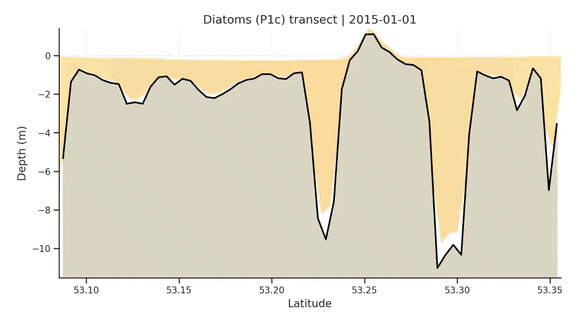

# Wadden Sea Ecosystem Model Output as a Service (Wad_EMOaaS):
**Wad_EMOaaS** is a service developed within the **LTER-LIFE** project for exploring four-dimensional (3D + time) hydro-biogeochemical model outputs of the Dutch Wadden Sea. The virtual research environment will be a place to process four dimensional ecosystem model output for the western Dutch Wadden Sea. The model output in netcdf format is produced by a 3-D hydrodynamic-biogeochemical model (GETM-ERSEM-BFM, https://github.com/LTER-LIFE/GETM_ERSEM_SETUPS). The focus is on the pelagic and benthic compartments of the ecosystems, and extensive data validation in comparison to observation data (e.g., NIOZ Jetty monitoring data, SIBES & SUBES dataset). 

## Targeted users:
The expected output is a Model data product and will be peer-reviewed before delivering it to the Wadden Sea Science Community. 

### Keywords
Wadden Sea Ecosystem Model, Pelagic and Benthic coupling; Ecosystem Digital Twin Downscalling

---
A **Digital Twin** is defined as:

> *"A digital twin is a computational model of an intended or actual real-world physical product, system, or process (a physical twin) that serves as a digital counterpart of it for purposes such as simulation, integration, testing, monitoring, and maintenance."*
> *(Source: https://en.wikipedia.org/wiki/Digital_twin)*

An **ecosystem Digital Twin** extends this concept by integrating process-based models, observations, and data-driven approaches to represent ecosystem states and dynamics. The key characteristics and requirements of ecosystem Digital Twins are discussed in our recent publication:

🔗*Visser et al. (2026)*: https://www.sciencedirect.com/science/article/pii/S0169534726001035

---

## Physical Twin of the Wadden Sea Ecosystem

The Wadden Sea is the world's largest continuous intertidal ecosystems and a UNESCO World Heritage Site. The Wadden Sea ecosystem in the real-world:

© 2026, *Tjitske Kooistra*

## Digital Twin of the Wadden Sea Ecosystem:
The Digital Twin represents the coupled physical and ecological processes of the Wadden Sea through high-resolution numerical modelling and interactive data exploration.

https://github.com/user-attachments/assets/ab2ff978-1a69-49f5-863b-5069ba22b703

Note that the vertical exaggeration 100x. 
The app is under development. © 2026, *Petros Giannopoulos (https://github.com/PetrosGiannopoulos)*

---

## Model domain & 4d example outputs

### Top view:

### Transect view:

---

## Contact

The ecosystem Digital Twin and **Wad_EMOaaS** are under active development.

Questions, suggestions, and collaborations are welcome. Please open an issue in this repository or contact the developers:
Qing Zhan (qing.zhan@nioz.nl); Christos Giannopoulos (christos.giannopoulos@nioz.nl) 

---

## License

The contents of this repository are currently under preparation for publication. Therefore, the model assets, data, and associated resources should not be reused, redistributed, or modified without prior consultation with the developers.

For citation information and guidelines, please refer to:

`CITATION.cff`
